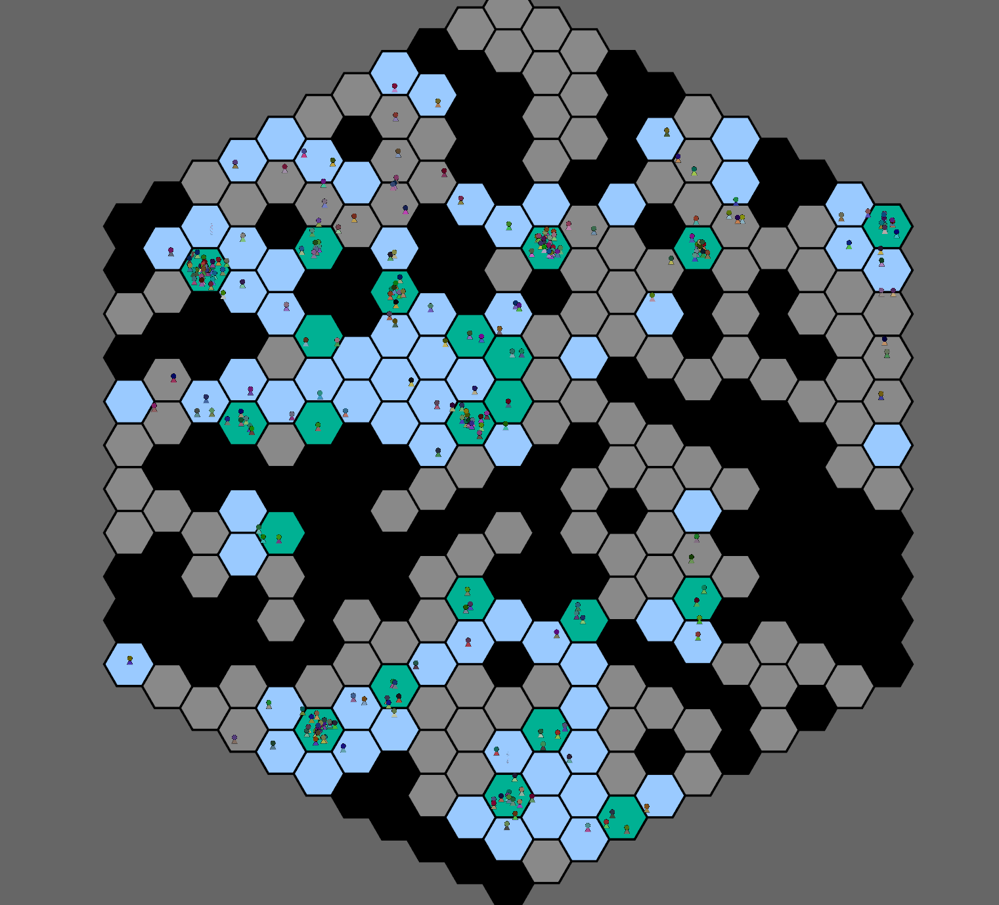

# Cofee Rush Hour

A game made for https://itch.io/jam/mini-jam-87-break. Simple management strategy in which you place coffee shops where workers will have their break.

Every customer brings up to 2 moneys depending on the distance they travelled. Coffee shops serve customers at a certain ratio.
If a customer waited for too long they leave and you pay a fee. Playing field increases over time. Place your shops strategically, although it is very hard to lose.

# Known bugs

Rarely crashes from `Entity does not exist`.

# License

All code and assets (except fonts) is licensed under MIT license.
Fira Sans font is [licensed](https://fonts.google.com/specimen/Fira+Sans#about) under Open Font License.